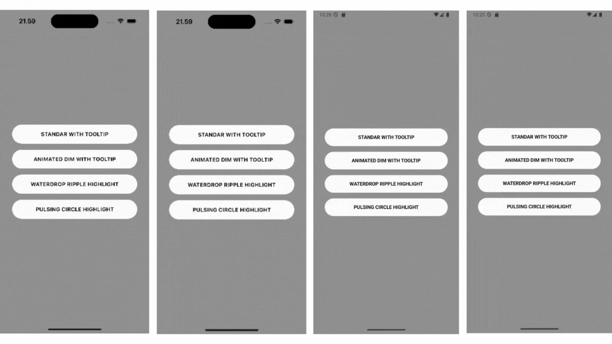

# Kotlin Multiplatform Library for Onboarding Showcases

A Kotlin Multiplatform library for creating onboarding showcases, UI highlights, and guided walkthroughs in Compose. Use it to spotlight key UI components, guide users step-by-step, and deliver polished intro experiences on both Android and iOS with simple, declarative APIs.

## Demo


## Usage

To get started, add the dependency to your `build.gradle.kts` file:

```kotlin
// in your commonMain dependencies
implementation("io.github.suwasto:kmp-showcase-compose:0.1.0")
```

For a complete example, check out the [composeApp](composeApp/src/commonMain/kotlin/io/github/suwasto/showcase) directory in the repository, which contains the usage of UI components and utilities for showcase onboarding.

### Step 1: Set up `ShowcaseHost` and Controller

First, wrap your screen's content with `ShowcaseHost` and create a `ShowcaseController` to manage the showcase.

```kotlin
@Composable
fun MyScreen() {
    val showcaseController = rememberShowcaseController()

    ShowcaseHost(controller = showcaseController) {
        // The rest of your screen's UI, e.g., a Scaffold
    }
}
```

### Step 2: Capture Component Bounds

To highlight a UI element, you need to capture its layout bounds. The `captureBounds` modifier makes this easy. It’s best to use a map to store the bounds (`Rect`) of each component you want to highlight.

```kotlin
// An enum to uniquely identify each highlight
enum class ShowcaseHighlight {
    Search, Bag
}

// Inside your composable
val showcaseLayouts = remember { mutableStateMapOf<ShowcaseHighlight, Rect>() }

// Apply the modifier to a component
IconButton(
    modifier = Modifier.captureBounds { rect ->
        showcaseLayouts[ShowcaseHighlight.Search] = rect
    },
    onClick = { /* ... */ }
) {
    Icon(Icons.Default.Search, contentDescription = "Search")
}
```

### Step 3: Define `ShowcaseStep`s

Once you have the bounds, you can define the steps for your showcase. A `ShowcaseStep` describes a single highlighted element and its accompanying content. The content can be any composable, not just a `Tooltip`. Using `derivedStateOf` ensures that your steps update automatically when the layout bounds are resolved. 

Define the steps inside your main composable so you can access the `showcaseController` if needed (e.g., for a "Next" button).

```kotlin
val showcaseSteps by remember(showcaseController) {
    derivedStateOf {
        listOfNotNull(
            showcaseLayouts[ShowcaseHighlight.Search]?.let { rect ->
                ShowcaseStep(
                    rect = rect,
                    content = { highlightRect ->
                        Tooltip(
                            anchorRect = highlightRect, 
                            direction = TooltipDirection.Bottom
                        ) {
                            Text("Use this to search for products.")
                        }
                    }
                )
            },
            showcaseLayouts[ShowcaseHighlight.Bag]?.let { rect ->
                 ShowcaseStep(
                    rect = rect,
                    style = ShowcaseStyle.Standard(shape = ShowcaseShape.Circle),
                    content = { _ ->
                        Column(horizontalAlignment = Alignment.CenterHorizontally) {
                            Text("Check your shopping bag here.")
                            Button(onClick = { showcaseController.next() }) {
                                Text("Next Step")
                            }
                        }
                    }
                )
            }
        )
    }
}
```

### Step 4: Start the Showcase

Finally, use a `LaunchedEffect` to start the showcase once the steps are defined. To ensure the showcase runs only once, you can use a `rememberSaveable` flag.

```kotlin
LaunchedEffect(YourKey) {
    if (YourCondition) {
        showcaseController.start(showcaseSteps)
    }
}
```

### Putting It All Together

Here’s a complete example that combines all the steps into a single, self-contained composable.

```kotlin
// An enum to uniquely identify each highlight
enum class ShowcaseHighlight {
    Search, Bag
}

@Composable
fun MyScreenWithShowcase() {
    val showcaseController = rememberShowcaseController()

    // 1. A map to hold the layout bounds of the components to be highlighted.
    val showcaseLayouts = remember { mutableStateMapOf<ShowcaseHighlight, Rect>() }

    // 2. Define the showcase steps.
    // This is a derived state, so it will automatically update when showcaseLayouts changes.
    val showcaseSteps by remember(showcaseController) {
        derivedStateOf {
            listOfNotNull(
                showcaseLayouts[ShowcaseHighlight.Search]?.let { rect ->
                    ShowcaseStep(
                        rect = rect,
                        content = { highlightRect ->
                            Tooltip(
                                anchorRect = highlightRect,
                                direction = TooltipDirection.Bottom
                            ) {
                                Text("Use this to search for products.")
                            }
                        }
                    )
                },
                showcaseLayouts[ShowcaseHighlight.Bag]?.let { rect ->
                    ShowcaseStep(
                        rect = rect,
                        style = ShowcaseStyle.Standard(shape = ShowcaseShape.Circle),
                        content = { _ ->
                            Column(horizontalAlignment = Alignment.CenterHorizontally) {
                                Text("Check your shopping bag here.")
                                Button(onClick = { showcaseController.next() }) {
                                    Text("Next Step")
                                }
                            }
                        }
                    )
                }
            )
        }
    }

    // 3. Use a LaunchedEffect to start the showcase.
    // rememberSaveable is used to ensure the showcase runs only once.
    var shouldShowShowcase by rememberSaveable { mutableStateOf(false) }
    LaunchedEffect(shouldShowShowcase) {
        if (shouldShowShowcase) {
            showcaseController.start(showcaseSteps)
        }
    }

    // 4. Wrap your UI with ShowcaseHost and use the captureBounds modifier.
    ShowcaseHost(controller = showcaseController) {
        Scaffold(
            topBar = {
                TopAppBar(
                    title = { Text("My App") },
                    actions = {
                        IconButton(
                            modifier = Modifier.captureBounds { rect ->
                                showcaseLayouts[ShowcaseHighlight.Search] = rect
                            },
                            onClick = { /* ... */ }
                        ) {
                            Icon(Icons.Default.Search, contentDescription = "Search")
                        }
                    }
                )
            },
            floatingActionButton = {
                FloatingActionButton(
                    modifier = Modifier.captureBounds { rect ->
                        showcaseLayouts[ShowcaseHighlight.Bag] = rect
                    },
                    onClick = { /* ... */ }
                ) {
                    Icon(Icons.Default.ShoppingBag, contentDescription = "Bag")
                }
            }
        ) { paddingValues ->
            // Main content
            Box(modifier = Modifier.padding(paddingValues).fillMaxSize()) {
                Text(
                    text = "Content of the screen",
                    modifier = Modifier.align(Alignment.Center)
                )
            }
        }
    }
}
```

### `ShowcaseStep` Parameters

| Parameter | Description |
|---|---|
| `rect` | The `Rect` of the component to highlight. |
| `style` | The style of the showcase highlight. See `ShowcaseStyle`. |
| `highlightPadding` | Padding to apply to the highlighted area. |
| `onClickHighlight` | A lambda to be invoked when the highlighted area is clicked. |
| `enableDimAnim` | Whether to animate the dim background. |
| `dimAnimationDurationMillis` | The duration of the dim animation. |
| `dimColor` | The color of the dim background. |
| `content` | The content to display for this step. This can be any composable and receives the `highlightRect` as a parameter. |

### `Tooltip` Parameters

| Parameter | Description |
|---|---|
| `anchorRect` | The `Rect` of the component to which the tooltip is anchored. |
| `direction` | The direction in which the tooltip should be displayed relative to the anchor. See `TooltipDirection`. |
| `bubbleStyle` | The style of the tooltip bubble. See `TooltipBubbleStyle`. |
| `content` | The content to display inside the tooltip. |

### 📄 License

```
Copyright 2025 Anang Suwasto

Licensed under the Apache License, Version 2.0 (the "License");
you may not use this file except in compliance with the License.
You may obtain a copy of the License at

    http://www.apache.org/licenses/LICENSE-2.0

Unless required by applicable law or agreed to in writing, software
distributed under the License is distributed on an "AS IS" BASIS,
WITHOUT WARRANTIES OR CONDITIONS OF ANY KIND, either express or implied.
See the License for the specific language governing permissions and
limitations under the License.
```